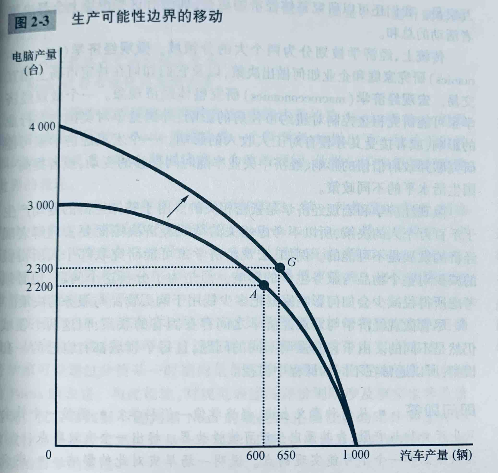

# 像经济学家一样思考

## 作为科学家的经济学家

> 科学的本质是科学方法——冷静地建立并检验有关世界如何运行的各种理论。这种研究方法也适用于研究一国经济。

### 科学方法：观察、理论和进一步观察

理论与观察之间的相互作用也发生在经济学领域中。经济学家会首先提出一种经济理论，并通过发生的经济现象验证这种理论。但是经济学家无法像一般科学家一样通过实验验证理论，通常只能使用这个世界向他们提供的数据。经济学家更多关注的是历史事件，这些事件不仅是我们能了解过去的经济，也能使我们对当前的经济理论做出说明和评价。

### 假设的作用

假设可以使复杂的世界简单化，从而使解释这个世界变得更为容易。假设也被用来回答不同的问题。

### 经济模型

经济学家通常用由图形和方程组成的模型来了解世界。用模型来研究各种经济问题是，会看到所有模型都建立在一些假设之上。而且所有模型都喂了加深我们对现实的理解而进行了细节上的简化。

### 第一个模型：循环流量图

**循环流量图：** 一个说明货币如何通过市场在家庭与企业之间流动的直观经济模型。

### 第二个模型：生产可能性边界

**生产可能性边界：** 表示在可得到的生产要素与生产技术既定时，一个经济所能生产的产品数量的各种组合的图形。

生产可能性边界的两个端点代表如果该经济把全部资源都用于某个行业的极端可能性。更为可能的情况是，这个经济把资源平均分配在两个行业中，如图中A点和B点所示。由于资源是稀缺的，所以无论怎么分配资源，都不可能达到C点的电脑和汽车产出量。

一个经济可以用它所拥有的资源在生产可能性边界上以及以内的任何一点进行生产，但不能在这条边界以外的任何一点进行生产。

生产可能性边界线上的产出结果是<u>有效率的</u>（如ABEF），线内的产出结果是无效率的（如D点）。

生产可能性边界表明了社会所面临的一种权衡取舍，也体现了十大原理中的机会成本。在E点时，生产汽车的机会成本最高，此时生产可能性边界是陡峭的。当该经济生产少量汽车和大量电脑时，例如在F点时，生产可能性边界是平坦的，并且生产汽车的机会成本较低。

生产可能性边界表明在某一特定时点生产不同物品之间的权衡取舍，但随着时间推移，这种权衡取舍可能改变。例如电脑行业的技术进步提高了电脑的生产效率，这时候对于任何一种既定的非端点的汽车产量，该经济现在都可以生产比以前更多的电脑。这就是生产可能性边界的向外移动。

### 微观经济学与宏观经济学

**微观经济学：** 研究家庭和企业如何做出决策，以及它们如何在市场上相互交易的学科。
**宏观经济学：** 研究整体经济现象，包括通货膨胀、失业和经济增长的学科。

## 作为政策顾问的经济学家

>当经济学家试图去解释世界时，他们是科学家；当经济学家试图去帮助改善世界时，他们时政策顾问。

### 实证分析与规范分析

>A：最低工资法引起了失业。
>
>B：政府应该提高最低工资。

这里A的说法像一个科学家

    实证表述：试图描述世界是什么样子的观点。

B的说法像一个政策顾问

    规范表述：试图描述世界应该是什么样子的观点。

**实证表述**和**规范表述**之间的关键区别是我们如何判断他们的正确性。原则上可以通过检验证据来确认或否定实证表述，而对规范表述的评价则既涉及事实也涉及价值观。

经济学的许多内容是实证的，但经济学家通常有规范的目的，他们想知道如何改善经济。

### 华盛顿的经济学家们

美国总统和政府行政部门一直得到经济学家的指导和建议。经济学家的研究和著作经常间接地影响政策。

### 为什么经济学家的建议并不总是被采纳

制定经济政策的过程在很多方面与经济学教科书上假设的理想化决策过程完全不同。领导人的性格影响了政策的选择，而选择正确的政策仅仅是领导人工作的一部分，有时候还是最容易的一部分。领导人在听取了经济顾问的意见后还会听取其他顾问的意见，在听取并权衡了这些意见后才会做出决策。
