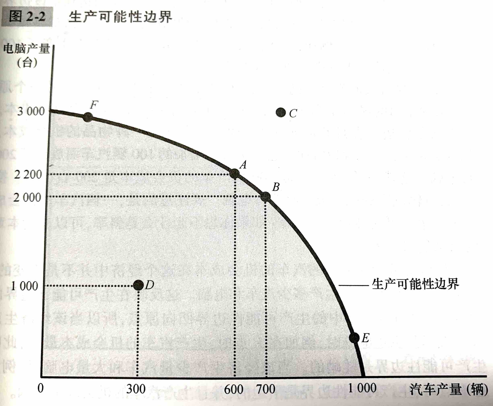

# 像经济学家一样思考

## 作为科学家的经济学家

> 科学的本质是科学方法——冷静地建立并检验有关世界如何运行的各种理论。这种研究方法也适用于研究一国经济。

### 科学方法：观察、理论和进一步观察

理论与观察之间的相互作用也发生在经济学领域中。经济学家会首先提出一种经济理论，并通过发生的经济现象验证这种理论。但是经济学家无法像一般科学家一样通过实验验证理论，通常只能使用这个世界向他们提供的数据。经济学家更多关注的是历史事件，这些事件不仅是我们能了解过去的经济，也能使我们对当前的经济理论做出说明和评价。

### 假设的作用

假设可以使复杂的世界简单化，从而使解释这个世界变得更为容易。假设也被用来回答不同的问题。

### 经济模型

经济学家通常用由图形和方程组成的模型来了解世界。用模型来研究各种经济问题是，会看到所有模型都建立在一些假设之上。而且所有模型都喂了加深我们对现实的理解而进行了细节上的简化。

### 第一个模型：循环流量图

**循环流量图：** 一个说明货币如何通过市场在家庭与企业之间流动的直观经济模型。

### 第二个模型：生产可能性边界

**生产可能性边界：** 表示在可得到的生产要素与生产技术既定时，一个经济所能生产的产品数量的各种组合的图形。

生产可能性边界的两个端点代表如果该经济把全部资源都用于某个行业的极端可能性。更为可能的情况是，这个经济把资源平均分配在两个行业中，如图中A点和B点所示。由于资源是稀缺的，所以无论怎么分配资源，都不可能达到C点的电脑和汽车产出量。

一个经济可以用它所拥有的资源在生产可能性边界上以及以内的任何一点进行生产，但不能在这条边界以外的任何一点进行生产。

生产可能性边界线上的产出结果是<u>有效率的</u>（如ABEF），线内的产出结果是无效率的（如D点）。

生产可能性边界表明了社会所面临的一种权衡取舍，也体现了十大原理中的机会成本。